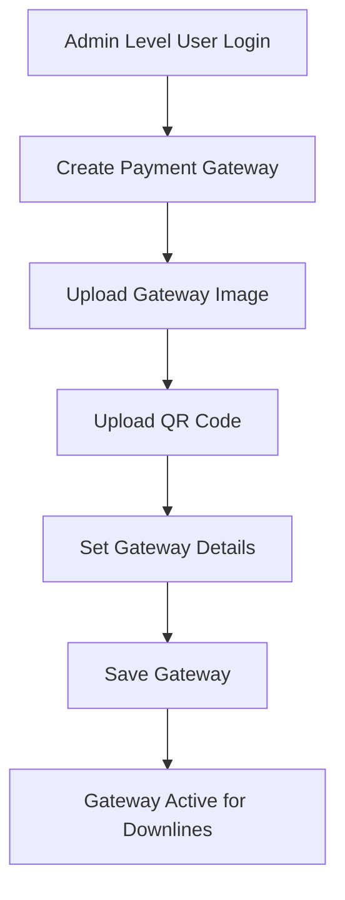
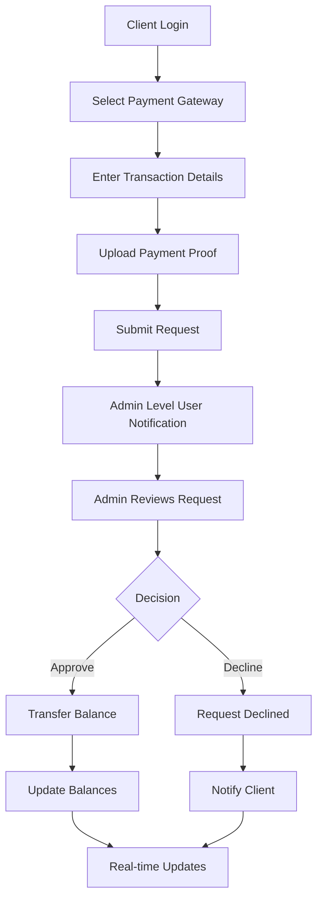
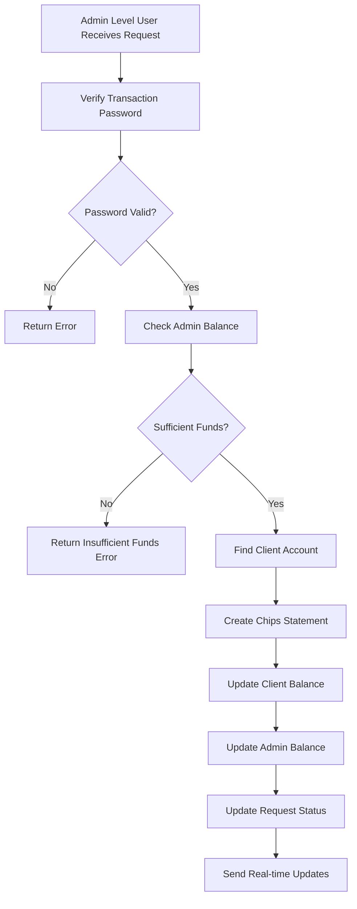

# Payment Gateway System Documentation

## Table of Contents
1. [Overview](#overview)
2. [System Architecture](#system-architecture)
3. [Data Models](#data-models)
4. [API Endpoints](#api-endpoints)
5. [User Roles & Permissions](#user-roles--permissions)
6. [Deposit Request Flow](#deposit-request-flow)
7. [Security Features](#security-features)
8. [Real-time Updates](#real-time-updates)
9. [Error Handling](#error-handling)
10. [File Management](#file-management)
11. [Database Transactions](#database-transactions)
12. [Validation Rules](#validation-rules)
13. [Configuration](#configuration)

## Overview

The Payment Gateway System is a comprehensive solution for handling deposit requests in a betting platform. It allows multiple user roles (Developer, TechAdmin, Admin, MiniAdmin, SuperMaster, Master, SuperAgent, Agent) to create and manage payment methods for their downlines, while clients can use these gateways to request deposits. The system includes real-time updates, security validations, and proper transaction management.

### Key Features
- Multi-gateway support with custom configurations
- Real-time balance updates via WebSocket
- Secure transaction processing with password validation
- File upload handling for payment proofs
- Hierarchical user management (All Admin Levels → Clients)
- Comprehensive validation and error handling
- Multi-level payment gateway management

## System Architecture

### User Hierarchy
```
Developer (Top Level)
    ↓
TechAdmin
    ↓
Admin
    ↓
MiniAdmin
    ↓
SuperMaster
    ↓
Master
    ↓
SuperAgent
    ↓
Agent
    ↓
Client (Creates Deposit Requests)
```

### Payment Gateway Management Hierarchy
All user roles from **Developer** down to **Agent** can:
- Create payment gateways for their downlines
- Manage gateway configurations
- Process deposit requests from their downlines
- Approve/decline deposit requests

## Multi-Level Payment Gateway Management

### Hierarchical Gateway Management
The payment gateway system supports a multi-level hierarchy where each admin level can create and manage payment gateways for their direct downlines:

#### Gateway Creation Flow
```
Developer
    ↓ Creates gateways for → TechAdmin
TechAdmin
    ↓ Creates gateways for → Admin
Admin
    ↓ Creates gateways for → MiniAdmin
MiniAdmin
    ↓ Creates gateways for → SuperMaster
SuperMaster
    ↓ Creates gateways for → Master
Master
    ↓ Creates gateways for → SuperAgent
SuperAgent
    ↓ Creates gateways for → Agent
Agent
    ↓ Creates gateways for → Client
```

#### Gateway Visibility
- **Created Gateways**: Each admin level can see gateways they created
- **Assigned Gateways**: Each level can see gateways created by their upline
- **Client Access**: Clients can only see gateways created by their direct upline

#### Balance Transfer Hierarchy
When a deposit request is approved:
1. Balance is deducted from the approving admin level user
2. Balance is credited to the requesting client
3. All upline users maintain their balance structure
4. Commission flows according to the established hierarchy

### User Role Capabilities

| User Role | Can Create Gateways For | Can Process Requests From | Balance Management |
|-----------|------------------------|---------------------------|-------------------|
| Developer | TechAdmin | All levels | System level |
| TechAdmin | Admin | Admin + downlines | High level |
| Admin | MiniAdmin | MiniAdmin + downlines | High level |
| MiniAdmin | SuperMaster | SuperMaster + downlines | Mid level |
| SuperMaster | Master | Master + downlines | Mid level |
| Master | SuperAgent | SuperAgent + downlines | Mid level |
| SuperAgent | Agent | Agent + downlines | Mid level |
| Agent | Client | Client only | Low level |
| Client | None | None | Receives only |

### Gateway Assignment Logic
```javascript
// Clients can only see gateways created by their direct upline
const assignedGateways = await PayementGatewayModel.find({
  createdBy: req.profile?.upline,  // Direct upline only
  isActive: true,
});
```

### Request Processing Logic
```javascript
// Admin level users can process requests from their downlines
const incomingRequests = await DepositRequestModel.find({
  upline: req?.profile?._id,  // Requests directed to this admin
  groupID: req?.profile?.groupID,
});
```

### Core Components
1. **Payment Gateway Model** - Stores gateway configurations
2. **Deposit Request Model** - Manages deposit transactions
3. **Base Request Model** - Common fields for all request types
4. **Chips Statement Model** - Tracks balance movements
5. **User Models** - Manages all user types (Developer, TechAdmin, Admin, MiniAdmin, SuperMaster, Master, SuperAgent, Agent, Client)

## Data Models

### Payment Gateway Schema
```javascript
{
  gatewayMethod: String,           // Payment method name (e.g., "UPI", "Bank Transfer")
  gatewayImage: String,            // Path to gateway logo/image
  qrImage: String,                 // Path to QR code image
  gatewayDetails: Object,          // Configuration object with min amounts, account details
  isActive: Boolean,              // Gateway status (default: true)
  createdBy: ObjectId,            // Reference to BaseUserSchema (Agent)
  timestamps: true                // createdAt, updatedAt
}
```

### Deposit Request Schema
```javascript
{
  transactionNo: String,          // Transaction reference number
  paymentProof: String,           // Path to uploaded payment proof
  amount: Number,                 // Deposit amount
  Balance: Number,                // User balance at time of request
  IpAddress: String,             // Client IP address
  status: String,                 // "Pending", "Approved", "Declined"
  reason: String,                 // Reason for decline (optional)
  upline: ObjectId,              // Reference to agent
  GatewayMethod: Object,         // Embedded gateway details
  groupID: String,               // User group identifier
  loginId: String                // User login identifier
}
```

## API Endpoints

### Payment Gateway Management (All Admin Levels)

**Accessible by:** Developer, TechAdmin, Admin, MiniAdmin, SuperMaster, Master, SuperAgent, Agent

#### Create Payment Gateway
```
POST /createpaymentgateway
Headers: Authorization (Any admin level token)
Body: {
  gatewayMethod: string,
  gatewayDetails: string (JSON)
}
Files: gatewayImage, qrImage
Response: { success: boolean, msg: string }
```

#### Update Payment Gateway
```
PATCH /updatepaymentgateway/:id
Headers: Authorization (Any admin level token)
Body: {
  gatewayMethod?: string,
  gatewayDetails?: string (JSON)
}
Files: gatewayImage?, qrImage?
Response: { success: boolean, msg: string }
```

#### Delete Payment Gateway
```
DELETE /deletepaymentgateway/:id
Headers: Authorization (Any admin level token)
Response: { success: boolean, msg: string }
```

#### Toggle Gateway Status
```
PATCH /paymentgateway/activateDeactivate/:id
Headers: Authorization (Any admin level token)
Response: { success: boolean, msg: string }
```

#### Get Created Gateways
```
GET /paymentgateway/created/getall
Headers: Authorization (Any admin level token)
Response: { success: boolean, paymentGateway: array }
```

#### Get Assigned Gateways
```
GET /paymentgateway/assigned/getall
Headers: Authorization (Client token)
Response: { success: boolean, paymentGateway: array }
```

### Deposit Request Management

#### Create Deposit Request
```
POST /createdepositrequest
Headers: Authorization (Client token)
Body: {
  transactionNo: string,
  amount: number,
  IpAddress: string (IPv4),
  GatewayMethodId: string
}
Files: paymentProof
Response: { success: boolean, msg: string }
```

#### Get My Deposit Requests
```
GET /getmydepositrequest
Headers: Authorization (Client token)
Response: { success: boolean, depositRequests: array }
```

#### Get Incoming Deposit Requests
```
GET /recievingDepositRequest
Headers: Authorization (Any admin level token)
Query: page, limit, searchValue
Response: { 
  success: boolean, 
  totalDepositRequest: number,
  page: number,
  limit: number,
  depositRequests: array 
}
```

#### Update Deposit Request (Approve/Decline)
```
PUT /updateDepositRequest/:requestId
Headers: Authorization (Any admin level token)
Body: {
  transactionPassword: string,
  status: "Approved" | "Declined",
  reason?: string
}
Response: { success: boolean, msg: string }
```

## User Roles & Permissions

### Admin Level Permissions (Developer, TechAdmin, Admin, MiniAdmin, SuperMaster, Master, SuperAgent, Agent)
- Create, update, delete payment gateways for their downlines
- Upload gateway images and QR codes
- Activate/deactivate gateways
- View all created gateways
- Receive and process deposit requests from their downlines
- Approve/decline deposit requests from their downlines
- View incoming deposit requests with pagination and search
- Manage gateway configurations and minimum amounts
- Transfer balance to approved downline users

### Client Permissions
- View assigned payment gateways (created by their upline admin)
- Create deposit requests using available gateways
- Upload payment proof
- View own deposit request history
- Receive real-time balance updates

## Deposit Request Flow

### 1. Gateway Creation (Any Admin Level)


### 2. Deposit Request Process (Client → Admin Level)


### 3. Approval Process Details


## Security Features

### Authentication & Authorization
- JWT token-based authentication
- Role-based access control (All Admin Levels vs Client)
- Transaction password required for approvals
- IP address validation for deposit requests

### Data Validation
- Input sanitization and validation using Joi
- File type and size restrictions
- Minimum amount validation per gateway
- Duplicate transaction prevention

### Transaction Security
- Database transactions for data consistency
- Session management for concurrent operations
- File cleanup on failed operations
- Error handling with proper rollback

## Real-time Updates

### WebSocket Events
The system uses Socket.IO for real-time communication:

#### Balance Updates
```javascript
// Admin level user balance update
io.sockets.emit("sendchips" + adminUserId, {
  Balance: newBalance
});

// Client balance update
io.sockets.emit("recievechips" + clientId, {
  Balance: newBalance
});
```

#### Request Count Updates
```javascript
// New request notification
io.sockets.emit("sendDepositWithdrawCount" + adminUserId, {
  count: 1
});

// Request processed notification
io.sockets.emit("sendDepositWithdrawCount" + adminUserId, {
  count: -1
});
```

## Error Handling

### Common Error Scenarios
1. **Invalid Gateway Method** - Gateway not found or inactive
2. **Insufficient Funds** - Admin level user doesn't have enough balance
3. **Minimum Amount** - Deposit below gateway minimum
4. **Transaction Password** - Incorrect password for approval
5. **File Upload Errors** - Invalid file type or size
6. **Concurrent Transactions** - Multiple operations on same session

### Error Response Format
```javascript
{
  success: false,
  error: "Error message description"
}
```

### Transaction Rollback
All critical operations use database transactions with proper rollback:
```javascript
try {
  session.startTransaction();
  // ... operations
  await session.commitTransaction();
} catch (error) {
  await session.abortTransaction();
  // ... cleanup and error response
} finally {
  session.endSession();
}
```

## File Management

### File Upload Configuration
- **Gateway Images**: Stored in `uploads/PaymentGateway/`
- **QR Codes**: Stored in `uploads/PaymentGateway/`
- **Payment Proofs**: Stored in `uploads/PaymentProof/`

### File Operations
- Automatic file cleanup on gateway deletion
- File replacement on gateway updates
- File cleanup on failed deposit requests
- Multer middleware for file handling

### File Validation
- Image file types only
- Maximum file size limits
- Secure file naming
- Path sanitization

## Database Transactions

### Transaction Usage
- Deposit request creation
- Deposit request approval/decline
- Balance transfers
- File operations

### Transaction Benefits
- Data consistency
- Atomic operations
- Rollback capability
- Concurrent operation prevention

## Validation Rules

### Payment Gateway Validation
```javascript
{
  gatewayMethod: Joi.string().required(),
  gatewayDetails: Joi.any().allow(null)
}
```

### Deposit Request Validation
```javascript
{
  IpAddress: Joi.string().pattern(/^(?:(?:25[0-5]|2[0-4][0-9]|[01]?[0-9][0-9]?)\.){3}(?:25[0-5]|2[0-4][0-9]|[01]?[0-9][0-9]?)$/).required(),
  transactionNo: Joi.string().required(),
  amount: Joi.number().required().min(1),
  GatewayMethodId: Joi.string().required()
}
```

### Update Request Validation
```javascript
{
  transactionPassword: Joi.string().required(),
  status: Joi.string().required(),
  reason: Joi.string().allow(null, "")
}
```

## Configuration

### Environment Variables
- Database connection strings
- JWT secrets
- File upload paths
- Socket.IO configuration

### Gateway Details Structure
The `gatewayDetails` object can contain:
```javascript
{
  "Min Amount": number,           // Minimum deposit amount
  "Max Amount": number,           // Maximum deposit amount (optional)
  "Account Number": string,       // Bank account number
  "IFSC Code": string,           // Bank IFSC code
  "UPI ID": string,             // UPI identifier
  "Account Holder": string,      // Account holder name
  // ... other gateway-specific fields
}
```

### File Upload Limits
- Maximum file size per upload
- Allowed file types
- Maximum number of files per request
- Storage path configuration

## Best Practices

### For Admin Level Users (Developer, TechAdmin, Admin, MiniAdmin, SuperMaster, Master, SuperAgent, Agent)
1. Always verify payment proofs before approval
2. Maintain sufficient balance for downline deposits
3. Use strong transaction passwords
4. Regularly review gateway configurations
5. Monitor deposit request patterns from downlines
6. Ensure proper balance management across hierarchy levels

### For Clients
1. Use correct transaction reference numbers
2. Upload clear payment proof images
3. Ensure deposit amount meets minimum requirements
4. Keep transaction records for reference
5. Contact upline admin for any issues

### For Developers
1. Always use database transactions for critical operations
2. Implement proper error handling and rollback
3. Validate all inputs thoroughly
4. Clean up files on failed operations
5. Use proper logging for debugging
6. Implement rate limiting for API endpoints
7. Monitor system performance and resource usage

## Troubleshooting

### Common Issues

#### Gateway Not Found
- Check if gateway is active
- Verify admin level user permissions
- Ensure correct gateway ID

#### Insufficient Funds
- Check admin level user balance
- Verify deposit amount
- Contact upline for balance top-up

#### File Upload Failures
- Check file size limits
- Verify file type
- Ensure proper permissions
- Check disk space

#### Transaction Failures
- Verify transaction password
- Check database connectivity
- Review error logs
- Ensure proper session handling

### Debug Information
- Enable detailed logging
- Monitor database transactions
- Check WebSocket connections
- Review file system permissions
- Monitor memory usage

## Future Enhancements

### Potential Improvements
1. **Automated Approvals** - AI-based payment proof verification
2. **Multiple Currency Support** - International payment methods
3. **Payment Gateway APIs** - Direct integration with payment providers
4. **Advanced Analytics** - Transaction reporting and insights
5. **Mobile App Support** - Native mobile applications
6. **Blockchain Integration** - Cryptocurrency payment support
7. **Fraud Detection** - Advanced security measures
8. **Bulk Operations** - Batch processing capabilities

### Scalability Considerations
1. **Database Optimization** - Indexing and query optimization
2. **Caching Strategy** - Redis for session and data caching
3. **Load Balancing** - Multiple server instances
4. **CDN Integration** - File delivery optimization
5. **Microservices** - Service decomposition for better scalability

---

*This documentation covers the complete payment gateway system implementation. For technical support or feature requests, please contact the development team.*
